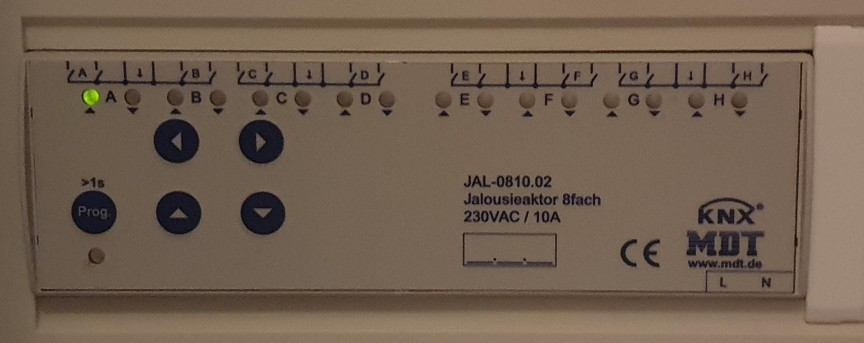

This is using a [kBerry](https://github.com/yene/kBerry) to control this



via KNX. It is in turn controlling my Venetian blinds.

The device is listening to `group_write`.
The value written is either `0` ascend or `1` descend.

The circuits `A` to `H` mapped to an contiguous address range on the bus.
This address is added with `0x1100` to move a single step and with `0x1000` to move all the way.

Group ID `0` is the wind sensor. If it transmits `1` everything goes all the way up. Otherwise it transmits `0` and everything stays wherever it is.

# compile
drop libkdriveExpress.so in the repos root and run `cargo build --release` (on a Pi).
I think I got the library from [rpi-kdriveexpress-monitor](https://github.com/marssys/rpi-kdriveexpress-monitor)

```
md5sum baos_ctrl/libkdriveExpress.so
5e47f74ec10b8e35e4a852bc99b77674  baos_ctrl/libkdriveExpress.so
```

# run

The program will listen on port 1337 for TCP connections.
You can send it `T C` where `T` is the target (or a Group like `A` for all) and `C` is the command:

| C | Action    |
|---|-----------|
| 1 | Close     |
| 0 | Open      |
| Z | Close     |
| A | Open      |
| S | Stop      |
| D | Step Down |
| U | Step Up   |

Stop equals Step Down like on the included remote